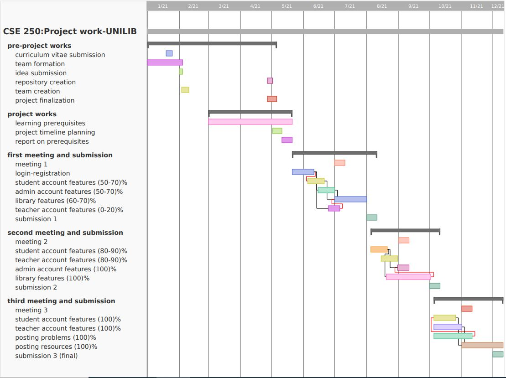

# G08-Library-Management-System
-------------
## Project Title: UniLib  
###### A web application of a digital academic library for both students and teachers. 
----------------------------
## Expected Timeline:

--------------
## Feature Description:
### 1. Students and teachers - the users:
* Users can update or delete their accounts. They’ll have a profile with a history of borrowed and returned books. Users will have access to different collections of books.
* They can request, or recommend, or even report about books.
* They can check a book’s availability, the number of total available books. They also may read the first few pages of books. They must issue the hard copies from the admin later. If there are soft copies, they can download these.
* Users can search by book’s name, author’s name, or the subject’s name.
* Users will get notified of recently added books.
* Users can upload notes, books, research papers, or any other soft copies for fellow students. Others may download them.
* Users can post about their academic problems. Others can comment, vote or report the posts. It’ll be free of the admin’s supervision.
### 2. Admins:
* They will conduct the whole system.
* They can look into other users, create accounts for teachers, delete certain user accounts, respond to other users’ problems and solve them, look into reports of the users.
* They can update and categorize the database(removing or adding a book, changing the status of a book). 
* They can notify users about their requested books, deadlines, and how to pay for the fine.
## Report on Learning Pre-requisites:
SL | Learning Task | Description | Status | Comment |
:-:|:--------------|:------------|:------:|---------|
1| Web Basics    | Vanilla Javascript, React, Node |   
2| UI library and frameworks | Ant Design for React, Next.js |  
3| Database | MySQL |  
4| Notifications | Mailgun, Socket.io |   | <ul><li>Mailgun-2018331022</li><li>Socket.io- 2018331072</li></ul>
